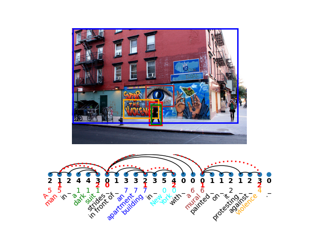

<div align="center">

# Multimodal-Probes



In this project we created a new method for probing the embeddings for multimodal-BERT models.
Furthermore, we provide a mapping to create the novel _Scene Tree_ structure over the image regions.
It is created by using the dependency tree of a caption and imposing it on the attached regions.

---

<p>
    <a href="#Probing">Probing</a> •
    <a href="#Scene-Tree">Scene Tree</a> •
    <a href="#Repository-Layout">Repository Layout</a> •
    <a href="#Install">Install</a> •
    <a href="#How-to-Run ">How to Run</a> •
    <a href="#Citation">Citation</a>
</p>

[](https://github.com/VSJMilewski/multimodal-probes/actions/workflows/lint.yml)
[](./LICENSE)
[](https://arxiv.org/abs/2203.09306)
[![Conference](https://img.shields.io/badge/ACL-2022-ec1c25.svg?logo=data:image/svg+xml;base64,PD94bWwgdmVyc2lvbj0iMS4wIiBlbmNvZGluZz0iVVRGLTgiIHN0YW5kYWxvbmU9Im5vIj8+CjwhLS0gQ3JlYXRlZCB3aXRoIElua3NjYXBlIChodHRwOi8vd3d3Lmlua3NjYXBlLm9yZy8pIC0tPgo8c3ZnCiAgIHhtbG5zOnN2Zz0iaHR0cDovL3d3dy53My5vcmcvMjAwMC9zdmciCiAgIHhtbG5zPSJodHRwOi8vd3d3LnczLm9yZy8yMDAwL3N2ZyIKICAgdmVyc2lvbj0iMS4wIgogICB3aWR0aD0iNjgiCiAgIGhlaWdodD0iNDYiCiAgIGlkPSJzdmcyIj4KICA8ZGVmcwogICAgIGlkPSJkZWZzNCIgLz4KICA8cGF0aAogICAgIGQ9Ik0gNDEuOTc3NTUzLC0yLjg0MjE3MDllLTAxNCBDIDQxLjk3NzU1MywxLjc2MTc4IDQxLjk3NzU1MywxLjQ0MjExIDQxLjk3NzU1MywzLjAxNTggTCA3LjQ4NjkwNTQsMy4wMTU4IEwgMCwzLjAxNTggTCAwLDEwLjUwMDc5IEwgMCwzOC40Nzg2NyBMIDAsNDYgTCA3LjQ4NjkwNTQsNDYgTCA0OS41MDA4MDIsNDYgTCA1Ni45ODc3MDgsNDYgTCA2OCw0NiBMIDY4LDMwLjk5MzY4IEwgNTYuOTg3NzA4LDMwLjk5MzY4IEwgNTYuOTg3NzA4LDEwLjUwMDc5IEwgNTYuOTg3NzA4LDMuMDE1OCBDIDU2Ljk4NzcwOCwxLjQ0MjExIDU2Ljk4NzcwOCwxLjc2MTc4IDU2Ljk4NzcwOCwtMi44NDIxNzA5ZS0wMTQgTCA0MS45Nzc1NTMsLTIuODQyMTcwOWUtMDE0IHogTSAxNS4wMTAxNTUsMTcuOTg1NzggTCA0MS45Nzc1NTMsMTcuOTg1NzggTCA0MS45Nzc1NTMsMzAuOTkzNjggTCAxNS4wMTAxNTUsMzAuOTkzNjggTCAxNS4wMTAxNTUsMTcuOTg1NzggeiAiCiAgICAgc3R5bGU9ImZpbGw6I2VkMWMyNDtmaWxsLW9wYWNpdHk6MTtmaWxsLXJ1bGU6ZXZlbm9kZDtzdHJva2U6bm9uZTtzdHJva2Utd2lkdGg6MTIuODk1NDExNDk7c3Ryb2tlLWxpbmVjYXA6YnV0dDtzdHJva2UtbGluZWpvaW46bWl0ZXI7c3Ryb2tlLW1pdGVybGltaXQ6NDtzdHJva2UtZGFzaGFycmF5Om5vbmU7c3Ryb2tlLWRhc2hvZmZzZXQ6MDtzdHJva2Utb3BhY2l0eToxIgogICAgIGlkPSJyZWN0MjE3OCIgLz4KPC9zdmc+Cg==)](https://aclanthology.org/2022.acl-long.388/)
</div>

## Probing
This repository is build as a modular probing project.
By running the main file, you get access to all the possible datasets and probes.
While the project is called Multimodal-Probes, it is still possible to
train and use probes on uni-modal data or uni-modal models.
Simply run `python main.py --help` to get a list of options.
Initialy, this is a general set of options. Once you start setting some
options (like the `--task`), you get more specific options to see
if the probe works with the current task.

## Scene Tree
The _scene tree_ is a novel structure that creates a hierarchical structure over
the regions in an image. For the construction, we assume to have images with captions,
where words/phrases are aligned with regions in the image
(e.g. [Flickr30K Entities](https://bryanplummer.com/Flickr30kEntities/)).

A dependency structure is extracted for the caption using the spacy parser,
and we map this structure on top of the connected regions in the image.
This results in the _scene tree_.

Most of needed methods for creating the _scene tree_ are contained in the `probing_project/scene_tree.py` file.
The remaining methods are imported from `probing_project/utils.py`, `probing_project/tasks/depth_task.py`,
and `probing_project/tasks/depth_task.py`.

## Repository Layout
- __main.py__: Handles the entire probing program
- data:
  - raw: downloads of all needed datasets
  - intermediate: all processed data not needed for main run
  - processed: all finished data needed for main run
  - __README.md__: Describes the data sources used in the paper and how to prepare the image region features
- scripts:
  - __extract_flickr_30k_images.py__: script for extracting image region features
- probing_project:
  - data:
    - datasets: dataset specific preprocessing and loading methods
    - modules: _pytorch-lightning DataModule_ type classes for preprocessing and loading the data
    - __probing_dataset.py__: the project pytorch dataset-type class
    - __utils.py__: utilities needed for the dataset class
  - embedding_mappings: processing of the embeddings before probing (DiskMapping does nothing)
  - losses: additional losses for some tasks
  - probes: the torch.nn.module functions for the probes
  - reporters: the classes for computing metrics and results
  - tasks: the possible task to probe on, each task should have one or more accompanying probes
  - __constants.py__: General information needed, i.e. volta configs, optional settings for help message
  - __model.py__: the main _pytorch-lightning LightningModule-type_ class
  - __scene_tree.py__: the specific files for generating the scene tree
  - __utils.py__: extra utility functions
- volta: __CREATE MANUALLY__ a clone of the volta repository, needed for running with the multimodal-BERT models

## Install 
First clone and install dependencies
```bash
# clone project
git clone https://github.com/VSJMilewski/multimodal-probes

# install project
cd multimodal-probes
```

Manually install the pytorch following their
[get started](https://pytorch.org/get-started/locally/) page. We used **version 1.10.1**.

Next, install the other requirements.
```bash
pip install -r requirements.txt
```

If you want to use the multimodal models as used in the paper
(and currently the only setup in the code), clone the 
[Volta Library](https://github.com/e-bug/volta) into the root directory
(or install it somewhere else and use a symbolic link).

## How to Run
Simply run the main with `python main.py` file and set the needed options.

Minimum required options to set is:
 - --task
 - --probe
 - --dataset
 - --embeddings_model

An example run:
```bash
# run module
python main.py --task DepthTask --dataset Flickr30k  --probe OneWordPSDProbe --embeddings_model ViLBERT
```

Use the `--help` flag to see a full set of options:
```bash
python main.py --help
```
Depending on which required arguments you have set already,
the __help output__ changes to show available options with those settings

--- 

## Credits

Initial code for probes, evaluations, losses, and some of the data processing was taken 
from the [Structural-Probes Project](https://github.com/john-hewitt/structural-probes)
by Hewitt and Manning (2019).

---

## Citation
If you use this repository, please cite:
```text
@inproceedings{milewski-etal-2022-finding,
    title = "Finding Structural Knowledge in Multimodal-{BERT}",
    author = "Milewski, Victor  and
      de Lhoneux, Miryam  and
      Moens, Marie-Francine",
    booktitle = "Proceedings of the 60th Annual Meeting of the Association for Computational Linguistics (Volume 1: Long Papers)",
    month = may,
    year = "2022",
    address = "Dublin, Ireland",
    publisher = "Association for Computational Linguistics",
    url = "https://aclanthology.org/2022.acl-long.388",
    pages = "5658--5671",
    abstract = "In this work, we investigate the knowledge learned in the embeddings of multimodal-BERT models. More specifically, we probe their capabilities of storing the grammatical structure of linguistic data and the structure learned over objects in visual data. To reach that goal, we first make the inherent structure of language and visuals explicit by a dependency parse of the sentences that describe the image and by the dependencies between the object regions in the image, respectively. We call this explicit visual structure the scene tree, that is based on the dependency tree of the language description. Extensive probing experiments show that the multimodal-BERT models do not encode these scene trees.",
}
```
